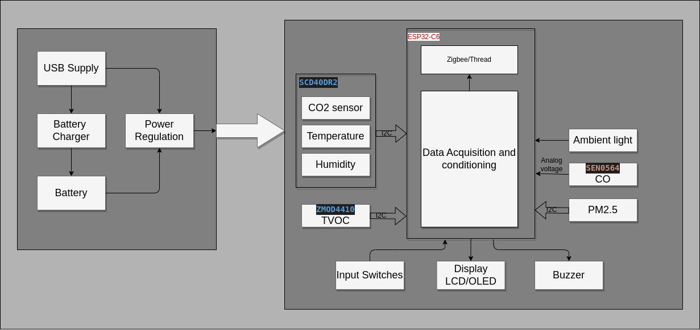

# Air Quality Monitor(AQM)

The following block diagram captures the raw outline on how the Air quality monitor hardware design is envisioned.

The data acquisition and conditioning block acquires various sensor data to measure parameters of the surrounding air and determines the air quality. Based on the data and the internal thresholds for the associated parameters an audio/visual alarm can be raised.
The sensor data will also be broadcasted over a zigbee / thread network and can be collected by central hub for monitoring or control of other equipment to improve / aid in improving the quality of the surrounding air.

## Goal
- [ ] **Sensor Data Aquisition & Calibration**
  - [ ] Temperature
  - [ ] Relative Humidity
  - [ ] CO2
  - [ ] TVOC
  - [ ] PM2.5
  - [ ] CO 
- [ ] **Local Display**
  - [ ] UI design
- [ ] **Communication**
  - [ ] Zigbee
  - [ ] Thread

## Hardware choices
The aim is to squeeze the Data Acquistion & conditioning along with the communication into a single microcontroller. A couple of low cost options were considered as captured in [Choices.md](./Design/Choices.md).  
The hardware section would look roughly like below: 

## Software choices
The software be designed around an RTOS either Zephyr or Freertos that is supported by the Espressif toolchain.